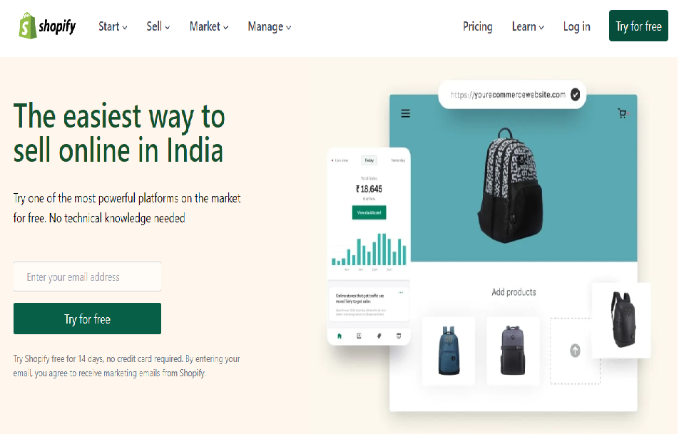

# Clonned Webpage of SHOPIFY.in
## Concepts Learnt
- Creating responsive hero sections, blog and card sections.
- Fixing height and width for parent and child elements properly.
- Creating horizontal and vertical lines in tailwind css
- Modifying the designs of an element while hovering.
- configuring some additional properties  in tailwind css

### Time Taken:  3 days
 

Because of this project I have learnt how to design a webpage including different types of sections like header, hero section,blogs, cards, tables etc.

[netlify link](https://shopify-clone-homepage.netlify.app/)

